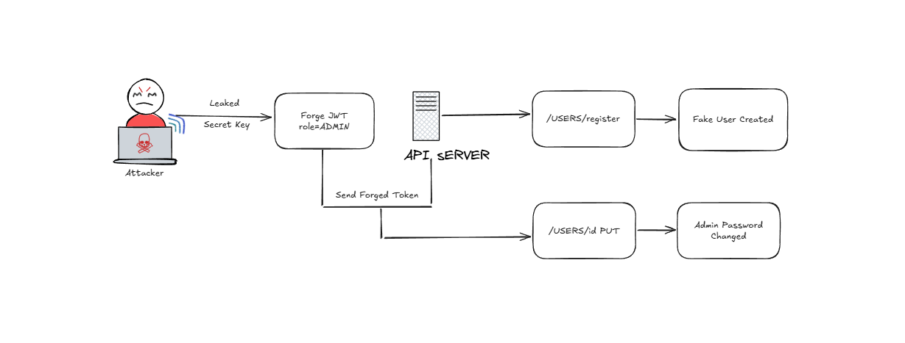
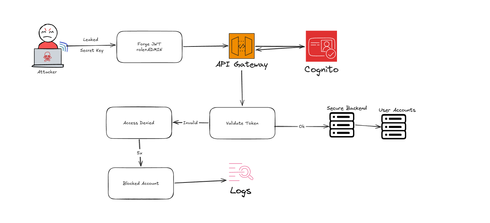

# Token Injection Vulnerability

## OWASP Top 10 Relation
This vulnerability relates to multiple OWASP Top 10 categories:

- **[Broken Authentication](https://owasp.org/Top10/2025/A01_2025-Broken_Access_Control/)** → weak or missing refresh token management, allowing attackers to forge sessions.  
- **[Cryptographic Failures](https://owasp.org/Top10/2025/A04_2025-Cryptographic_Failures/)** → leaked secret key enabled token forgery.  
- **[Insecure Design](https://owasp.org/Top10/2025/A06_2025-Insecure_Design/)** → lack of session inactivity handling and refresh token rotation.  
- **[Injection](https://owasp.org/Top10/2025/A05_2025-Injection/)** → attacker manipulated JWT payloads to escalate privileges.  
- **[Security Logging & Alerting Failures](https://owasp.org/Top10/2025/A09_2025-Security_Logging_and_Alerting_Failures/)** → lack of logging information


## Vulnerable Scenario
In the vulnerable version of the API:

- The secret key leaked.  
- No refresh token mechanism existed.  
- Attackers could forge JWTs and impersonate users.  

---

## Exploit Example
Using Python, an attacker could generate arbitrary tokens:
```python
import jwt

secret = "leaked_secret_key"
payload = {
    "sub": "admin",
    "role": "ADMIN",
    "exp": 9999999999
}

token = jwt.encode(payload, secret, algorithm="HS256")
print(token)
```
With this forged token, the attacker could:

- Call` /users/register` to silently create new accounts.
- Call `/users/{id}` with PUT to reset the admin password, effectively taking control of the system.

This is a textbook case of **Privilege Escalation**: moving from a normal user role to administrator privileges through token forgery.



## Real-World Case Study
- **CVE‑2026‑29000 (pac4j‑jwt)**: A critical flaw in the pac4j JWT library allowed attackers to bypass authentication by forging tokens using only the server’s RSA public key.  
- **Impact:** attackers impersonated any user, including administrators, leading to **full system compromise**.  
- This mirrors our vulnerable API scenario, where forged tokens could reset admin credentials and silently create accounts.  
- Reference: [NVD CVE‑2026‑29000](ca://s?q=NVD_CVE-2026-29000)  


## Secure Architecture (AWS Example)
Migrating to AWS mitigates these risks:

- **Amazon Cognito User Pool** issues `access_token` (short‑lived) and `refresh_token` (rotated).  
- **API Gateway JWT Authorizer** validates tokens automatically against Cognito.  
- **Session inactivity** handled by frontend (e.g., auto‑logout after 15 minutes idle).  
- **Refresh token rotation** ensures stolen tokens cannot be reused.  
- **Security Logging**:  
  - All failed login attempts and invalid token uses are logged in **Amazon CloudWatch**.  
  - Logs can trigger **CloudWatch Alarms** or **GuardDuty** alerts for suspicious activity.  
  - Example: repeated invalid tokens from the same IP → alert for possible brute‑force or replay attack.  

**Architecture flow:**
1. User logs in → Cognito returns tokens.  
2. Client uses `access_token` for API calls.  
3. API Gateway validates JWT before forwarding to backend.  
4. Invalid tokens or failed authentication attempts are logged and monitored.  
5. Refresh token rotation + inactivity timeout prevent indefinite sessions.  




## On‑Premise Alternatives
For teams not using cloud:

- **Keycloak** → open‑source identity provider with refresh token rotation.  
- **OAuth2 Proxy + JWT middleware** → centralize token validation.  
- **Spring Authorization Server** → native Spring solution for issuing/validating tokens.  


## Mitigation Summary
- Implement **refresh tokens with rotation**.  
- Use **short expiration** for access tokens.  
- Enforce **session inactivity timeout** in frontend.  
- Store secrets securely (AWS Secrets Manager, Vault).  
- Prefer **managed IdPs** (Cognito, Keycloak) instead of custom JWT logic.  
- Enable **security logging and monitoring** to detect invalid token usage. 
